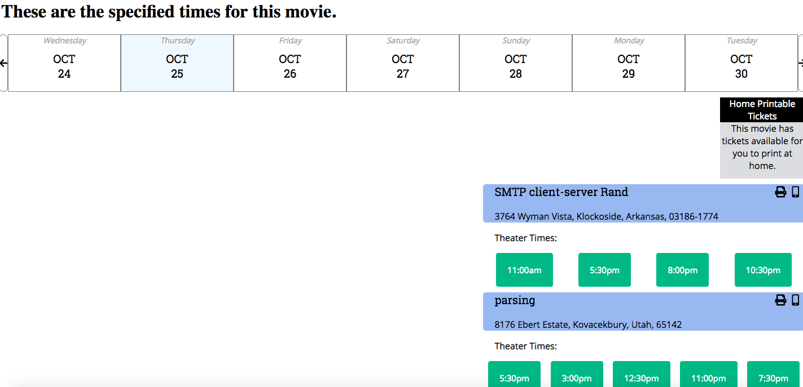

# Project Name

> Calendar, Modal & Theater listing for Moovi's Theatre View component.

## Related Projects

  - https://github.com/Team-DAD/movie-summary
  - https://github.com/Team-DAD/movie-dada
  - https://github.com/Team-DAD/movie-reviews

## Requirements

An `nvmrc` file is included if using [nvm](https://github.com/creationix/nvm).

- Node 6.13.0
- etc

### Installing Dependencies

From within the root directory:

```sh
npm install -g webpack
npm install
```

